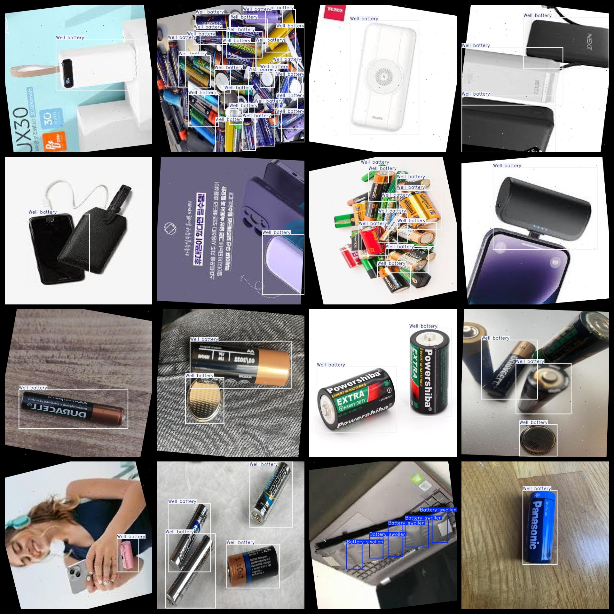
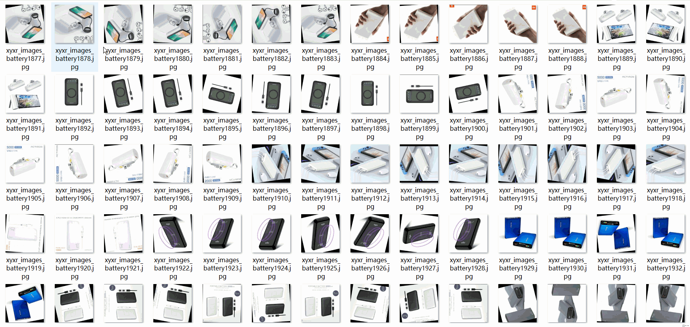

# Battery Defect Detection Dataset 7346 imagesVOC+YOLO format

Battery defect detection dataset 7346 sheets VOC + YOLO format

Dataset format: Pascal VOC format + YOLO format (the txt file does not contain the split path, it only contains jpg images and corresponding VOC format xml files and yolo format txt files)

Number of images (jpg file count): 7346

Number of xml files: 7346

Number of txt files: 7346

Number of annotated categories: 3

The Github repository is: datasets_sl

["Battery swollen", "Damaged battery", "Well battery"]

Number of boxes labeled in each category:

Battery swollen number of frames = 798 (battery expansion)

Damaged battery box number = 1235 (battery damaged)

Well battery frame number = 14349 (good battery)

Total frames: 16382

Number of images per category:

Battery swollen occupancy = 554

Damaged battery occupies 488 images =

Well battery occupancy = 6320

Image resolution: 640x640

Use the labeling tool: labelImg

Dataset Augmentation: Yes

Rules for annotation: Draw a rectangle around the category.

Important note: The dataset does not have been divided into training, validation, and testing sets.

Special Disclaimer: This dataset does not guarantee the accuracy of the trained models or weight files.

Annotation and image details are as follows:

## Images

---

Here is a pay link on Stripe (https://buy.stripe.com/3cs8yP7sY87d0vu9AB). Please contact me lonlonago@foxmail.com after funding $89, and I will send you a complete data files, thank you!

